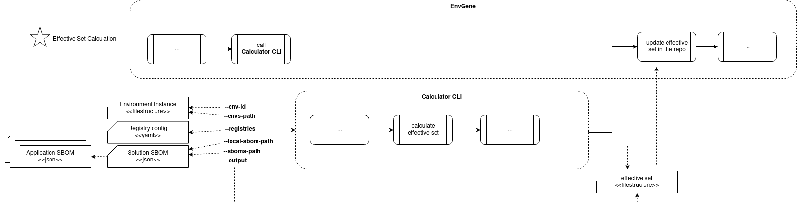

# Calculator CLI

- [Calculator CLI](#calculator-cli)
  - [Requirements](#requirements)
  - [Proposed Approach](#proposed-approach)
    - [Calculator CLI execution attributes](#calculator-cli-execution-attributes)
    - [Registry Configuration](#registry-configuration)
    - [Effective Set v1.0](#effective-set-v10)
      - [\[Version 1.0\] Effective Set Structure](#version-10-effective-set-structure)
      - [\[Version 1.0\] deployment-parameters.yaml](#version-10-deployment-parametersyaml)
      - [\[Version 1.0\] credentials.yaml](#version-10-credentialsyaml)
      - [\[Version 1.0\] technical-configuration-parameters.yaml](#version-10-technical-configuration-parametersyaml)
      - [\[Version 1.0\] mapping.yml](#version-10-mappingyml)
    - [Effective Set v2.0](#effective-set-v20)
      - [\[Version 2.0\] Effective Set Structure](#version-20-effective-set-structure)
      - [\[Version 2.0\] Parameter type conversion](#version-20-parameter-type-conversion)
      - [\[Version 2.0\] Service Inclusion Criteria and Naming Convention](#version-20-service-inclusion-criteria-and-naming-convention)
      - [\[Version 2.0\] Handling Missing Attributes in SBOM](#version-20-handling-missing-attributes-in-sbom)
      - [\[Version 2.0\] App chart validation](#version-20-app-chart-validation)
      - [\[Version 2.0\] Sensitive parameters processing](#version-20-sensitive-parameters-processing)
      - [\[Version 2.0\] Deployment Parameter Context](#version-20-deployment-parameter-context)
        - [\[Version 2.0\]\[Deployment Parameter Context\] `deployment-parameters.yaml`](#version-20deployment-parameter-context-deployment-parametersyaml)
          - [\[Version 2.0\] Predefined `deployment-parameters.yaml` parameters](#version-20-predefined-deployment-parametersyaml-parameters)
        - [\[Version 2.0\]\[Deployment Parameter Context\] `credentials.yaml`](#version-20deployment-parameter-context-credentialsyaml)
          - [\[Version 2.0\] Predefined `credentials.yaml` parameters](#version-20-predefined-credentialsyaml-parameters)
        - [\[Version 2.0\]\[Deployment Parameter Context\] Collision Parameters](#version-20deployment-parameter-context-collision-parameters)
        - [\[Version 2.0\]\[Deployment Parameter Context\] `deploy-descriptor.yaml`](#version-20deployment-parameter-context-deploy-descriptoryaml)
          - [\[Version 2.0\] Predefined `deploy-descriptor.yaml` parameters](#version-20-predefined-deploy-descriptoryaml-parameters)
          - [\[Version 2.0\] Service Artifacts](#version-20-service-artifacts)
          - [\[Version 2.0\] Primary Service Artifact](#version-20-primary-service-artifact)
          - [\[Version 2.0\] `tArtifactNames`](#version-20-tartifactnames)
        - [\[Version 2.0\]\[Deployment Parameter Context\] Per Service parameters](#version-20deployment-parameter-context-per-service-parameters)
          - [\[Version 2.0\]\[Deployment Parameter Context\] Resource Profile Processing](#version-20deployment-parameter-context-resource-profile-processing)
        - [\[Version 2.0\]\[Deployment Parameter Context\] `mapping.yml`](#version-20deployment-parameter-context-mappingyml)
      - [\[Version 2.0\] Pipeline Parameter Context](#version-20-pipeline-parameter-context)
        - [\[Version 2.0\]\[Pipeline Parameter Context\] `parameters.yaml`](#version-20pipeline-parameter-context-parametersyaml)
        - [\[Version 2.0\]\[Pipeline Parameter Context\] `credentials.yaml`](#version-20pipeline-parameter-context-credentialsyaml)
        - [Consumer Specific Context of Pipeline Context](#consumer-specific-context-of-pipeline-context)
          - [\[Version 2.0\]\[Pipeline Parameter Context\] `<consumer>-parameters.yaml`](#version-20pipeline-parameter-context-consumer-parametersyaml)
          - [\[Version 2.0\]\[Pipeline Parameter Context\] `<consumer>-credentials.yaml`](#version-20pipeline-parameter-context-consumer-credentialsyaml)
      - [\[Version 2.0\] Topology Context](#version-20-topology-context)
        - [\[Version 2.0\]\[Topology Context\] `composite_structure` Example](#version-20topology-context-composite_structure-example)
        - [\[Version 2.0\]\[Topology Context\] `k8s_tokens` Example](#version-20topology-context-k8s_tokens-example)
        - [\[Version 2.0\]\[Topology Context\] `environments` Example](#version-20topology-context-environments-example)
        - [\[Version 2.0\]\[Topology Context\] `cluster` Example](#version-20topology-context-cluster-example)
      - [\[Version 2.0\] Runtime Parameter Context](#version-20-runtime-parameter-context)
        - [\[Version 2.0\]\[Runtime Parameter Context\] `parameters.yaml`](#version-20runtime-parameter-context-parametersyaml)
        - [\[Version 2.0\]\[Runtime Parameter Context\] `credentials.yaml`](#version-20runtime-parameter-context-credentialsyaml)
        - [\[Version 2.0\]\[Runtime Parameter Context\] `mapping.yml`](#version-20runtime-parameter-context-mappingyml)
      - [\[Version 2.0\] Cleanup Context](#version-20-cleanup-context)
        - [\[Version 2.0\]\[Cleanup Context\] `parameters.yaml`](#version-20cleanup-context-parametersyaml)
        - [\[Version 2.0\]\[Cleanup Context\] `credentials.yaml`](#version-20cleanup-context-credentialsyaml)
        - [\[Version 2.0\]\[Cleanup Context\] `mapping.yml`](#version-20cleanup-context-mappingyml)
    - [Macros](#macros)
  - [Use Cases](#use-cases)
    - [Effective Set Calculation](#effective-set-calculation)

## Requirements

1. Calculator CLI must support [Effective Set version 1.0](#effective-set-v10) generation
2. Calculator CLI must support [Effective Set version 2.0](#effective-set-v20) generation
3. Calculator CLI must process [execution attributes](#calculator-cli-execution-attributes)
4. Calculator CLI must not encrypt or decrypt sensitive parameters (credentials.yaml)
5. Calculator CLI must resolve [macros](#macros)
6. Calculator CLI should not process Parameter Sets
7. Calculator CLI must not cast parameters type
8. Calculator CLI must display reason of error
9. Calculator CLI must must not lookup, download and process any artifacts from a registry
10. The Calculator CLI must support loading and parsing SBOM files, extracting parameters for calculating the Effective Set
    1. [Solution SBOM](../schemas/solution.sbom.schema.json)
    2. [Application SBOM](../schemas/application.sbom.schema.json)
    3. [Env Template SBOM](../schemas/env-template.sbom.schema.json)
11. Calculator CLI should generate Effective Set for one environment no more than 1 minute
12. The Calculator CLI must adhere to the [Service Inclusion Criteria and Naming Convention](#version-20-service-inclusion-criteria-and-naming-convention) when compiling the application's service list.
13. Parameters in all files of Effective Set must be sorted alphabetically
14. The value of `DEPLOYMENT_SESSION_ID` value must have the same value in all files in the Effective Set generated by a given operation

## Proposed Approach



### Calculator CLI execution attributes

Below is a **complete** list of attributes

| Attribute | Type | Mandatory | Description | Default | Example |
|---|---|---|---|---|--|
| `--env-id`/`-e` | string | yes | Environment id in `<cluster-name>/<environment-name>` notation | N/A | `cluster/platform-00` |
| `--envs-path`/`-ep` | string | yes | Path to `/environments` folder | N/A |  `/environments` |
| `--sboms-path`/`-sp`| string | yes | Path to the folder with Application and Environment Template SBOMs. In Solution SBOM, the path to Application SBOM and Environment Template SBOM is specified relative to this folder. | N/A |`/sboms` |
| `--solution-sbom-path`/`-ssp`| string | yes | Path to the Solution SBOM. | N/A | `/environments/cluster/platform-00/Inventory/solution-descriptor/solution.sbom.json` |
| `--registries`/`-r`| string | yes | Path to the [registry configuration](#registry-configuration) | N/A | `/configuration/registry.yml` |
| `--output`/`-o` | string | yes | Folder where the result will be put by Calculator CLI | N/A | `/environments/cluster/platform-00/effective-set` |
| `--effective-set-version`/`-esv` | string | no | The version of the effective set to be generated. Available options are `v1.0` and `v2.0` | `v2.0` | `v1.0` |
| `--pipeline-consumer-specific-schema-path`/`-pcssp` | string | no | Path to a JSON schema defining a consumer-specific pipeline context component. Multiple attributes of this type can be provided  | N/A |  |
| `--extra_params`/`-ex` | string | no | Additional parameters used by the Calculator for effective set generation. Multiple instances of this attribute can be provided | N/A | `DEPLOYMENT_SESSION_ID=550e8400-e29b-41d4-a716-446655440000` |
| `--app_chart_validation`/`-acv` | boolean | no | Determines whether [app chart validation](#version-20-app-chart-validation) should be performed. If `true` validation is enabled (checks for `application/vnd.qubership.app.chart` in SBOM). If `false` validation is skipped | `true` | `false` |

### Registry Configuration

[Registry config JSON Schema](../schemas/registry.schema.json)

[Registry config example](../schemas/registry.yml)

### Effective Set v1.0

#### [Version 1.0] Effective Set Structure

```text
...
└── environments
    └── <cluster-name-01>
        └── <environment-name-01>
            └── effective-set
                ├── mapping.yml
                ├── <deployPostfix-01>
                |   ├── <application-name-01>
                |   |   ├── deployment-parameters.yaml
                |   |   ├── technical-configuration-parameters.yaml
                |   |   └── credentials.yaml
                |   └── <application-name-02>
                |       ├── deployment-parameters.yaml
                |       ├── technical-configuration-parameters.yaml
                |       └── credentials.yaml
                └── <deployPostfix-02>
                    ├── <application-name-01>
                    |   ├── deployment-parameters.yaml
                    |   ├── technical-configuration-parameters.yaml
                    |   └── credentials.yaml
                    └── <application-name-02>
                        ├── deployment-parameters.yaml
                        ├── technical-configuration-parameters.yaml
                        └── credentials.yaml
```

#### [Version 1.0] deployment-parameters.yaml

```yaml
<key-1>: <value-1>
<key-N>: <value-N>
global: &id001
  <key-1>: <value-1>
  <key-N>: <value-N>
<service-name-1>:
  <<: *id001
  <service-key-1>: <value-1>
  <service-key-N>: <value-N>
<service-name-2>:
  <<: *id001
  <service-key-1>: <value-1>
  <service-key-N>: <value-N>
```

Each application microservice has its own dedicated section. These sections contain the same set of parameters as defined at the root level.

To avoid repetition, YAML anchors (&) are used for reusability, while aliases (*) reference them.

The `<value>` can be complex, such as a map or a list, whose elements can also be complex.

#### [Version 1.0] credentials.yaml

```yaml
<key-1>: <value-1>
<key-N>: <value-N>
```

Each application microservice has its own dedicated section. These sections contain the same set of parameters as defined at the root level.

To avoid repetition, YAML anchors (&) are used for reusability, while aliases (*) reference them.

#### [Version 1.0] technical-configuration-parameters.yaml

```yaml
<key-1>: <value-1>
<key-N>: <value-N>
```

#### [Version 1.0] mapping.yml

This file defines a mapping between Namespace's names and their corresponding folder paths in Effective Set file-structure.

This mapping is necessary because the Effective Set consumer requires knowledge of the specific Namespace's names. However, the Effective Set is stored in the repository in a structure optimized for comparing Effective Sets across Environments.

```yaml
---
<namespace-name-01>: <path-to-deployPostfix-01-folder-in-effective-set-file-structure>
<namespace-name-02>: <path-to-deployPostfix-02-folder-in-effective-set-file-structure>
```

Namespace name is taken from the `name` attribute of Namespace
Deploy Postfix is taken from the `deployPostfix` attribute of Namespace

Path is relative to the Instance repository (i.e., it starts with `/environments`)

For example:

```yaml
---
env-01-redis: /environments/cluster-01/env-01/effective-set/deployment/redis/
env-01-postgresql: /environments/cluster-01/env-01/effective-set/deployment/postgresql
env-01-platform-monitoring: /environments/cluster-01/env-01/effective-set/deployment/platform-monitoring
env-01-zookeeper: /environments/cluster-01/env-01/effective-set/deployment/zookeeper
```

### Effective Set v2.0

#### [Version 2.0] Effective Set Structure

```text
...
└── environments
    └── <cluster-name-01>
        └── <environment-name-01>
            └── effective-set
                ├── topology
                |   ├── parameters.yaml
                |   └── credentials.yaml              
                ├── pipeline
                |   ├── parameters.yaml
                |   ├── credentials.yaml
                |   ├── <consumer-name-01>-parameters.yaml
                |   ├── <consumer-name-02>-credentials.yaml
                |   ├── <consumer-name-01>-parameters.yaml
                |   └── <consumer-name-02>-credentials.yaml
                ├── deployment
                |   ├── mapping.yml
                |   ├── <deployPostfix-01>
                |   |   ├── <application-name-01>
                |   |   |   └── values
                |   |   |       ├── per-service-parameters
                |   |   |       |   ├── <normalized-app-chart-name> # Optional
                |   |   |       |   |   └── deployment-parameters.yaml
                |   |   |       |   ├── <service-name-01> # Optional
                |   |   |       |   |   └── deployment-parameters.yaml
                |   |   |       |   └── <service-name-02> # Optional
                |   |   |       |       └── deployment-parameters.yaml
                |   |   |       ├── deployment-parameters.yaml
                |   |   |       ├── collision-deployment-parameters.yaml
                |   |   |       ├── credentials.yaml
                |   |   |       ├── collision-credentials.yaml
                |   |   |       └── deploy-descriptor.yaml
                |   |   └── <application-name-02>
                |   |       └── values
                |   |           ├── per-service-parameters
                |   |           |   ├── <normalized-app-chart-name># Optional
                |   |           |   |   └── deployment-parameters.yaml
                |   |           |   ├── <service-name-01> # Optional
                |   |           |   |   └── deployment-parameters.yaml
                |   |           |   └── <service-name-02> # Optional
                |   |           |       └── deployment-parameters.yaml
                |   |           ├── deployment-parameters.yaml
                |   |           ├── collision-deployment-parameters.yaml
                |   |           ├── credentials.yaml
                |   |           ├── collision-credentials.yaml
                |   |           └── deploy-descriptor.yaml
                |   └── <deployPostfix-02>
                |       ├── <application-name-01>
                |       |   └── values
                |       |       ├── per-service-parameters
                |       |       |   ├── <normalized-app-chart-name> # Optional
                |       |       |   |   └── deployment-parameters.yaml
                |       |       |   ├── <service-name-01> # Optional
                |       |       |   |   └── deployment-parameters.yaml
                |       |       |   └── <service-name-02> # Optional
                |       |       |       └── deployment-parameters.yaml
                |       |       ├── deployment-parameters.yaml
                |       |       ├── collision-deployment-parameters.yaml
                |       |       ├── credentials.yaml
                |       |       ├── collision-credentials.yaml
                |       |       └── deploy-descriptor.yaml
                |       └── <application-name-02>
                |           └── values
                |               ├── per-service-parameters
                |               |   ├── <normalized-app-chart-name> # Optional
                |               |   |   └── deployment-parameters.yaml
                |               |   ├── <service-name-01> # Optional
                |               |   |   └── deployment-parameters.yaml
                |               |   └── <service-name-02> # Optional
                |               |       └── deployment-parameters.yaml
                |               ├── deployment-parameters.yaml
                |               ├── collision-deployment-parameters.yaml
                |               ├── credentials.yaml
                |               ├── collision-credentials.yaml
                |               └── deploy-descriptor.yaml
                ├── runtime
                |   ├── mapping.yml
                |   ├── <deployPostfix-01>
                |   |   ├── <application-name-01>
                |   |   |   ├── parameters.yaml
                |   |   |   └── credentials.yaml
                |   |   └── <application-name-02>
                |   |       ├── parameters.yaml
                |   |       └── credentials.yaml
                |   └── <deployPostfix-02>
                |       ├── <application-name-01>
                |       |   ├── parameters.yaml
                |       |   └── credentials.yaml
                |       └── <application-name-02>
                |           ├── parameters.yaml
                |           └── credentials.yaml
                └── cleanup
                    ├── mapping.yml
                    ├── <deployPostfix-01>
                    |   ├── parameters.yaml
                    |   └── credentials.yaml
                    └── <deployPostfix-02>
                        ├── parameters.yaml
                        └── credentials.yaml                            
```

#### [Version 2.0] Parameter type conversion

The Calculator CLI maintains strict type fidelity for all parameters during Effective Set generation
All parameters must retain their original types (string, boolean, integer) exactly as defined in:

- Environment Instance
- Application SBOM

**Absolutely no implicit type conversions are permitted** (e.g., string "42" → integer 42)

#### [Version 2.0] Service Inclusion Criteria and Naming Convention

The services list for an individual application is generated from the Application SBOM according to the following principles.  
It includes components from the Application SBOM with these `mime-type`:

- `application/vnd.qubership.service`
- `application/vnd.qubership.configuration.smartplug`
- `application/vnd.qubership.configuration.frontend`
- `application/vnd.qubership.configuration.cdn`
- `application/vnd.qubership.configuration`
- `application/octet-stream`

The service name is derived from the `name` attribute of the Application SBOM component.

#### [Version 2.0] Handling Missing Attributes in SBOM

> [!IMPORTANT]
>
> When a required attribute is missing in the SBOM
>
> Mandatory Attributes:
> If a default exists: The default value is applied  
> If no default exists: Throws readable error
>
> Optional Attributes:
> If a default exists: The default value is applied  
> If no default exists: The attribute remains unset  

#### [Version 2.0] App chart validation

The Calculator CLI performs validation to check for the presence of an `application/vnd.qubership.app.chart` component. The validation follows these rules:

1. If any of the Application SBOMs passed to the calculator does not contain a component with `application/vnd.qubership.app.chart` mime-type:

   - The calculation fails
   - An error message is logged

2. This validation is only performed for Effective Set version `v2.0`

3. Validation execution depends on the attribute:  
     [`GENERATE_EFFECTIVE_SET.app_chart_validation`](https://github.com/Netcracker/qubership-envgene/blob/feature/es_impovement_step_2/docs/instance-pipeline-parameters.md#effective_set_config)
   - Behavior:
     - If `true`: Validation is performed
     - If `false`: Validation is skipped

#### [Version 2.0] Sensitive parameters processing

Sensitive parameters in the Effective Set are grouped into dedicated credentials files for encryption and secure handling. The following files contains sensitive parameters:

1. `effective-set/topology/credentials.yaml`
2. `effective-set/pipeline/credentials.yaml`
3. `effective-set/pipeline/<consumer-name>-credentials.yaml`
4. `effective-set/deployment/<deployPostfix>/<application-name>/credentials.yaml`
5. `effective-set/deployment/<deployPostfix>/<application-name>/collision-credentials.yaml`
6. `effective-set/runtime/<deployPostfix>/<application-name>/credentials.yaml`

**Splitting principle:**

- If a parameter is defined in the Environment Instance using the [credential macro](/docs/template-macros.md#credential-macro), it is considered sensitive.
- If a parameter is part of a complex (nested) structure, only the sensitive subfields (those defined via the credential macro) are extracted and placed in the credentials file. The non-sensitive subfields remain in the non-sensitive parameters file.
- The split is performed recursively for all nested objects.

**Formal rule:**

- For any YAML object, if a key or subkey is defined via the credential macro, that key and its value are moved to the corresponding credentials file, preserving the nested structure. All other keys remain in the non-sensitive parameters file.

**Example:**

Given this parameter in the Environment Instance:

```yaml
complex_key:
  key:
    username: ${creds.get("cred-id").username}
    password: ${creds.get("cred-id").password}
    url: https://example.com
```

The Effective Set will be split as:

```yaml
# Non-sensitive file
complex_key:
  key:
    url: https://example.com
```

```yaml
# Sensitive file
complex_key:
  key:
    username: username
    password: password
```

#### [Version 2.0] Deployment Parameter Context

These parameters establish a dedicated rendering context exclusively applied during application (re)deployment operations for Helm manifest rendering.

This context is formed as a result of merging parameters defined in the `deployParameters` sections of the `Tenant`, `Cloud`, `Namespace`, `Application` Environment Instance objects. Parameters from the Application SBOM and `Resource Profile` objects of the Environment Instance also contribute to the formation of this context.

For each namespace/deploy postfix, the context contains files:

##### \[Version 2.0][Deployment Parameter Context] `deployment-parameters.yaml`

This file contains non-sensitive parameters defined in the `deployParameters` sections of the `Tenant`, `Cloud`, `Namespace`, `Application` Environment Instance objects.

It also includes a [predefined set of parameters](#version-20-predefined-deployment-parametersyaml-parameters) common to all application services.

The structure of this file is as follows:

```yaml
<key-1>: <value-1>
<key-N>: <value-N>
<application-predefined-key-1>: <application-predefined-value-1>
<application-predefined-key-N>: <application-predefined-value-N>
global: &id001
  <key-1>: <value-1>
  <key-N>: <value-N>
  <application-predefined-key-1>: <application-predefined-value-1>
  <application-predefined-key-N>: <application-predefined-value-N>
<service-name-1>: *id001
<service-name-2>: *id001
```

Each application microservice has its own dedicated section. These sections contain **the same** set of parameters as defined at the root level.

To avoid repetition, YAML anchors (&) are used for reusability, while aliases (*) reference them.

The `<value>` can be complex, such as a map or a list, whose elements can also be complex.

###### [Version 2.0] Predefined `deployment-parameters.yaml` parameters

| Attribute | Mandatory | Type | Description | Default | Source in Environment Instance or SBOM |
|---|---|---|---|---|---|
| `DEPLOYMENT_SESSION_ID` | yes | string | Effective Set calculation operation ID  | None | Taken from input parameter  `DEPLOYMENT_SESSION_ID` passed via `extra_params` (not from SBOM) |
| `MANAGED_BY` | yes | string | Deployer type. Always `argocd` | `argocd` | None |
| `CLOUD_API_HOST` | yes | string | Fully Qualified Domain Name of Cluster's API endpoint | None | `apiUrl` in the `Cloud` |
| `CLOUD_PUBLIC_HOST` | yes | string | Cluster's API endpoint accessible within a cluster network | None | `publicUrl` in the `Cloud` |
| `CLOUD_PRIVATE_HOST` | yes | string | Cluster's API endpoint accessible outside the cluster network | None | `privateUrl` in the `Cloud` |
| `CLOUD_PROTOCOL` | yes | string | Cluster's API protocol (http or https) | None | `protocol` in the `Cloud` |
| `CLOUD_API_PORT` | yes | string | Cluster's API port | None | `apiPort` in the `Cloud` |
| `SERVER_HOSTNAME` | yes | string | **Deprecated**. Uses `CLOUD_PUBLIC_HOST` if set, otherwise falls back to  `CLOUD_API_HOST`  | None | N/A |
| `CUSTOM_HOST` | yes | string | **Deprecated**. Uses `CLOUD_PRIVATE_HOST` if set, otherwise falls back to  `SERVER_HOSTNAME` | None | N/A |
| `OPENSHIFT_SERVER` | yes | string | **Deprecated**. Constructed as `CLOUD_PROTOCOL`://`CLOUD_PUBLIC_HOST`:`CLOUD_API_PORT` | None | N/A |
| `DBAAS_ENABLED` | yes | boolean | Feature toggle indicating whether DBaaS is used | `false` | `dbaasConfigs[0].enable` in the `Cloud` |
| `API_DBAAS_ADDRESS` | no | string | DBaaS API endpoint accessible within a cluster network. Provided if `DBAAS_ENABLED: true` only  | None | `dbaasConfigs[0].apiUrl` in the `Cloud` |
| `DBAAS_AGGREGATOR_ADDRESS` | no | string | DBaaS API endpoint accessible outside the cluster network. Provided if `DBAAS_ENABLED: true` only  | None | `dbaasConfigs[0].aggregatorUrl` in the `Cloud` |
| `MAAS_ENABLED` | yes | boolean | Feature toggle indicating whether MaaS is used | `false` | `maasConfig.enable` in the `Cloud` |
| `MAAS_INTERNAL_ADDRESS` | no | string | MaaS API endpoint accessible within a cluster network. Provided if `MAAS_ENABLED: true` only | None | `maasConfig.maasInternalAddress` in the `Cloud` |
| `MAAS_EXTERNAL_ROUTE` | no | string | Maas API endpoint accessible outside the cluster network. Provided if `MAAS_ENABLED: true` only | None | `maasConfig.maasUrl` in the `Cloud` |
| `MAAS_SERVICE_ADDRESS` | no | string | **Deprecated**. The same as `MAAS_EXTERNAL_ROUTE`. Provided if `MAAS_ENABLED: true` only | None | `maasConfig.maasUrl` in the `Cloud` |
| `VAULT_ENABLED` | yes | boolean | Feature toggle indicating whether Vault is used | `false` | `vaultConfig.enable` in the `Cloud` |
| `VAULT_ADDR` | no | string | Vault API endpoint accessible within a cluster network. Provided if `VAULT_ENABLED: true` only | None | `vaultConfig.enable` in the `Cloud` |
| `PUBLIC_VAULT_URL` | no | string | Vault API endpoint accessible outside the cluster network. Provided if `VAULT_ENABLED: true` only | None | `vaultConfig.url` in the `Cloud` |
| `CONSUL_ENABLED` | yes | boolean | Feature toggle indicating whether Consul is used | `false` | `consulConfig.enabled` in the `Cloud` |
| `CONSUL_URL` | no | string | Consul API endpoint accessible within a cluster network. Provided if `CONSUL_ENABLED: true` only | None | `consulConfig.internalUrl` in the `Cloud` |
| `CONSUL_PUBLIC_URL` | no | string | Consul API endpoint accessible within a cluster network. Provided if `CONSUL_ENABLED: true` only | None | `consulConfig.internalUrl` in the `Cloud` |
| `PRODUCTION_MODE` | no | boolean | Defines the deployment environment  (non-production/production) type for restricting Helm chart content | `false` | TBD |
| `CLOUDNAME` | yes | string | Cloud name | None | `name` in the `Cloud` |
| `TENANTNAME` | yes | string | Tenant name | None | `name` in the `Tenant` |
| `NAMESPACE` | yes | string | Namespace name | None | `name` in the corresponding `Namespace` |
| `GATEWAY_URL` | yes | string | **Deprecated**. TBD | `http://internal-gateway-service:8080` | TBD |
| `STATIC_CACHE_SERVICE_ROUTE_HOST` | yes | string | **Deprecated** Constructed as static-cache-service-`NAMESPACE`.`CLOUD_PUBLIC_HOST` | None | N/A |
| `SSL_SECRET` | yes | string | TBD | `defaultsslcertificate` | TBD |
| `BUILD_TAG_NEW` | yes | string | TBD | `keycloak-database` | TBD |
| `CLIENT_PREFIX` | yes | string | The same as `NAMESPACE` | None | N/A |
| `CERTIFICATE_BUNDLE_MD5SUM` | yes | string | TBD | TBD | TBD |
| `APPLICATION_NAME` | yes | string | Name of the application (not `Application` EnvGene object) | None | `SBOM.metadata.component.name` |
| `ORIGIN_NAMESPACE` | yes | string | The same as `NAMESPACE` | None | N/A |
| `BASELINE_PROJ` | yes | string | **Deprecated** | TBD | TBD |
| `PUBLIC_GATEWAY_URL` | yes | string | TBD | TBD | TBD |
| `INTERNAL_GATEWAY_URL` | yes | string | TBD | TBD | TBD |
| `PUBLIC_IDENTITY_PROVIDER_URL` | yes | string | TBD | TBD | TBD |
| `PRIVATE_GATEWAY_URL` | yes | string | TBD | TBD | TBD |
| `PRIVATE_IDENTITY_PROVIDER_URL` | yes | string | TBD | TBD | TBD |

> [!IMPORTANT]
> Parameters whose keys match the name of one of the services must be excluded from this file
> and placed in [`collision-deployParameters.yaml`](#version-20deployment-parameter-context-collision-parameters) instead

##### \[Version 2.0][Deployment Parameter Context] `credentials.yaml`

This file contains sensitive parameters defined in the `deployParameters` section of the `Tenant`, `Cloud`, `Namespace`, `Application` Environment Instance objects.

For more information, refer to [Sensitive parameters processing](#version-20-sensitive-parameters-processing).

It also includes a [predefined set of parameters](#version-20-predefined-credentialsyaml-parameters) common to all application services.

The structure of this file is as follows:

```yaml
<key-1>: <value-1>
<key-N>: <value-N>
<application-predefined-key-1>: <application-predefined-value-1>
<application-predefined-key-N>: <application-predefined-value-N>
global: &id001
  <key-1>: <value-1>
  <key-N>: <value-N>
  <application-predefined-key-1>: <application-predefined-value-1>
  <application-predefined-key-N>: <application-predefined-value-N>
<service-name-1>: *id001
<service-name-2>: *id001
```

###### [Version 2.0] Predefined `credentials.yaml` parameters

| Attribute | Mandatory | Type | Description | Default | Source Environment Instance |
|---|---|---|---|---|---|
| `K8S_TOKEN` | yes | string | Cluster's API token | None | Derived from the `data.secret` property of the `Credential` specified via `defaultCredentialsId` attribute in the corresponding `Namespace` or parent `Cloud`. If the attribute is not defined at the `Namespace` level, it is inherited from the parent `Cloud`. If defined at both levels, the `Namespace` value takes precedence |
| `DBAAS_AGGREGATOR_USERNAME` | no | string |  | None | Derived from the `data.username` property of the `Credential` specified via `dbaasConfigs[0].credentialsId.username` in the `Cloud`  |
| `DBAAS_AGGREGATOR_PASSWORD` | no | string |  | None | Derived from the `data.password` property of the `Credential` specified via `dbaasConfigs[0].credentialsId.password` in the `Cloud` |
| `DBAAS_CLUSTER_DBA_CREDENTIALS_USERNAME` | no | string |  | None | Derived from the `data.username` property of the `Credential` specified via `dbaasConfigs[0].credentialsId.username` in the `Cloud` |
| `DBAAS_CLUSTER_DBA_CREDENTIALS_PASSWORD` | no | string |  | None | Derived from the `data.password` property of the `Credential` specified via `dbaasConfigs[0].credentialsId.password` in the `Cloud` |
| `MAAS_CREDENTIALS_USERNAME` | no | string |  | None | Derived from the `data.username` property of the `Credential` specified via `maasConfig.credentialsId.username` in the `Cloud` |
| `MAAS_CREDENTIALS_PASSWORD` | no | string |  | None | Derived from the `data.password` property of the `Credential` specified via `maasConfig.credentialsId.password` in the `Cloud` |
| `VAULT_TOKEN` | no | string | ? | None | Derived from the `data.secret` property of the `Credential` specified via `vaultConfig.credentialsId.secret` in the `Cloud` |
| `CONSUL_ADMIN_TOKEN` | no | string |  | None | Derived from the `data.secret` property of the `Credential` specified via `consulConfig.internalUrl` in the `Cloud` |
| `SSL_SECRET_VALUE` | no | string | TBD | TBD | TBD |

> [!IMPORTANT]
> Parameters whose keys match the name of one of the services must be excluded from this file
> and placed in [`collision-credentials.yaml`](#version-20deployment-parameter-context-collision-parameters) instead

##### \[Version 2.0][Deployment Parameter Context] Collision Parameters

Parameters whose key matches the name of one of the [services](#version-20-service-inclusion-criteria-and-naming-convention) are placed in the following files:

- `collision-deployment-parameters.yaml`: if the parameter is non-sensitive (i.e., not defined via a credential macro).
- `collision-credentials.yaml`: if the parameter is sensitive (i.e., defined via a credential macro).

The structure of both files is following:

```yaml
<key-1>: <value-1>
<key-N>: <value-N>
```

These files must only contain keys that match the name of a [services](#version-20-service-inclusion-criteria-and-naming-convention)

##### \[Version 2.0][Deployment Parameter Context] `deploy-descriptor.yaml`

This file describes the parameters of the application artifacts generated during the build process. These parameters are extracted from the Application's SBOM. The file contains a **predefined** set of parameters, and users cannot modify it.

>[!Note]
> The `DEPLOYMENT_SESSION_ID` parameter is an exception to this rule - it is taken from `extra_params`

The structure of this file is as follows:

```yaml
global: &id001
  deployDescriptor: &id003
    <service-name-1>:
      <service-predefined-key-1>: <service-predefined-value-1>
      <service-predefined-key-N>: <service-predefined-value-N>
    <service-name-2>:
      <service-predefined-key-1>: <service-predefined-value-1>
      <service-predefined-key-N>: <service-predefined-value-N>
deployDescriptor: *id003
<service-name-1>: &id002
  <common-predefined-key-1>: <common-predefined-value-1>
  <common-predefined-key-N>: <common-predefined-value-N>
  deployDescriptor: *id003
  global: *id001
<service-name-2>: *id002
<common-predefined-key-1>: <common-predefined-value-1>
<common-predefined-key-N>: <common-predefined-value-N>
```

###### [Version 2.0] Predefined `deploy-descriptor.yaml` parameters

The structure of **service predefined** parameters in deploy-descriptor.yaml depends on the service type, determined by the MIME type assigned to the service in the SBOM. There are two types:

**Image Type**. Defined in the SBOM as components with these MIME types:

- `application/vnd.qubership.service`
- `application/octet-stream`

**Config Type**. Defined in the SBOM as components with these MIME types:

- `application/vnd.qubership.configuration.smartplug`
- `application/vnd.qubership.configuration.frontend`
- `application/vnd.qubership.configuration.cdn`
- `application/vnd.qubership.configuration`

**Common predefined** parameters have the same structure for all services.
Below are the descriptions of predefined parameters.

Common Predefined Parameters:

| Attribute | Mandatory | Type | Description | Default | Source in Application SBOM |
|---|---|---|---|---|---|
| `APPLICATION_NAME` | yes | string | Name of the application | None | `.metadata.component.name` |
| `DEPLOYMENT_SESSION_ID` | yes | string | Effective Set calculation operation ID  | None | Taken from input parameter  `DEPLOYMENT_SESSION_ID` passed via `extra_params` (not from SBOM) |
| `MANAGED_BY` | yes | string | Deployer type. Always `argocd` | `argocd` | None |

**Image Type** Service Predefined Parameters:

| Attribute | Mandatory | Type | Description | Default | Source in Application SBOM |
|---|---|---|---|---|---|
| `artifacts` | yes | list | always `[]` | `[]` | None |
| `deploy_param` | yes | string | None | `""` | `.components[?name=<service-name>].properties[?name=deploy_param].value` |
| `docker_digest` | yes | string | Docker image checksum for the service, calculated using `SHA-256` algorithm | `""` | `.components[?name=<service-name>].components[?mime-type=application/vnd.docker.image].hashes[0].content` |
| `docker_registry` | yes | string | None | None | `.components[?name=<service-name>].properties[?name=docker_registry].value` |
| `docker_repository_name` | yes | string | The registry repository where the Docker image is located | None | `.components[?name=<service-name>].components[?mime-type=application/vnd.docker.image].group` |
| `docker_tag` | yes | string | Docker image version | None | `.components[?name=<service-name>].components[?mime-type=application/vnd.docker.image].version` |
| `full_image_name` | yes | string | None | None | `.components[?name=<service-name>].properties[?name=full_image_name].value` |
| `git_branch` | yes | string | Source code branch name used for service build | None | `.components[?name=<service-name>].properties[?name=git_branch].value` |
| `git_revision` | yes | string | Git revision of the repository used for the build | None | `.components[?name=<service-name>].properties[?name=git_revision].value` |
| `git_url` | yes | string | None | None | `.components[?name=<service-name>].properties[?name=git_url].value` |
| `image` | yes | string | The same as `full_image_name` | None | `.components[?name=<service-name>].properties[?name=full_image_name].value` |
| `image_name` | yes | string | Docker image name | None | `.components[?name=<service-name>].components[?mime-type=application/vnd.docker.image].name` |
| `image_type` | yes | string | None | None | `.components[?name=<service-name>].properties[?name=image_type].value` |
| `name` | yes | string | Service name | None | `<service-name>` |
| `promote_artifacts` | yes | bool | None | None | `.components[?name=<service-name>].properties[?name=promote_artifacts].value` |
| `qualifier` | yes | string | None | None | `.components[?name=<service-name>].properties[?name=qualifier].value` |
| `version` | yes | string | Service version | None | `.components[?name=<service-name>].version` |

**Config Type** Service Predefined Parameters:

| Attribute | Mandatory | Type | Description | Default | Source in Application SBOM |
|---|---|---|---|---|---|
| `artifact` | no | string | [Primary Service Artifact](#version-20-primary-service-artifact) | None | None |
| `artifact.artifactId` | no | string | artifact ID of [Primary Service Artifact](#version-20-primary-service-artifact) | None | `<primary-service-artifact>.name`|
| `artifact.groupId` | no | string | group ID of [Primary Service Artifact](#version-20-primary-service-artifact)  | None | `<primary-service-artifact>.group` |
| `artifact.version` | no | string | version of [Primary Service Artifact](#version-20-primary-service-artifact)  | None | `<primary-service-artifact>.version`|
| `artifacts` | yes | list | This section defines microservice artifacts. Artifacts are only populated for services/SBOM components that meet [specified conditions](#version-20-service-artifacts). All other cases should return `[]` | `[]` | None |
| `artifacts[].artifact_id` | yes | string | always `''` | `''` | None |
| `artifacts[].artifact_path` | yes | string | always `''` | `''` | None |
| `artifacts[].artifact_type` | yes | string | always `''` | `''` | None |
| `artifacts[].classifier` | yes | string | None | None | `.components[?name=<service-name>].components[].properties[?name=classifier].value` |
| `artifacts[].deploy_params` | yes | string | always `''` | `''` | None |
| `artifacts[].gav` | yes | string | always `''` | `''` | None |
| `artifacts[].group_id` | yes | string | always `''` | `''` | None |
| `artifacts[].id` | yes | string | GAV coordinates of the artifact. Constructed by concatenating the `group`, `name`, and `version` attributes using `:` as separator | None | `.components[?name=<service-name>].components[].group`:`.components[?name=<service-name>].components[].name`:`.components[?name=<service-name>].components[].version` |
| `artifacts[].name` | yes | string | Constructed by concatenating the `name`, `version` and `type` attributes using `-` and `.`  as separator | None | `.components[?name=<service-name>].components[].name`-`.components[?name=<service-name>].components[].version`.`.components[?name=<service-name>].components[].properties[?name=type].value` |
| `artifacts[].repository` | yes | string | always `''` | `''` | None |
| `artifacts[].type` | yes | string | None | None | `.components[?name=<service-name>].components[].properties[?name=type].value` |
| `artifacts[].url` | yes | string | always `''` | `''` | None |
| `artifacts[].version` | yes | string | always `''` | `''` | None |
| `build_id_dtrust` | yes | string | None | None | `.components[?name=<service-name>].components[].properties[?name=build_id_dtrust].value` |
| `git_branch` | yes | string | Source code branch name used for service build | None | `.components[?name=<service-name>].properties[?name=git_branch].value` |
| `git_revision` | yes | string | Git revision of the repository used for the build | None | `.components[?name=<service-name>].properties[?name=git_revision].value` |
| `git_url` | yes | string | None | None | `.components[?name=<service-name>].components[].properties[?name=git_url].value` |
| `maven_repository` | yes | string | None | None | `.components[?name=<service-name>].components[].properties[?name=maven_repository].value` |
| `name` | yes | string | Service name | None | `<service-name>` |
| `service_name` | yes | string | Service name | None | `<service-name>` |
| `tArtifactNames` | yes | hashmap | This section defines microservice ZIP artifacts. Artifacts are only populated for services/SBOM components that meet [specified conditions](#version-20-service-artifacts). All other cases should return `{}` Described in [`tArtifactNames`](#version-20-tartifactnames) | `{}` | None |
| `type` | no | string | None | None | `.components[?name=<service-name>].components[].properties[?name=type].value` |
| `version` | yes | string | Service version | None | `.components[?name=<service-name>].version` |

###### [Version 2.0] Service Artifacts

Only services in the SBOM that have these MIME types may contain artifacts:

- `application/vnd.qubership.configuration.smartplug`  
- `application/vnd.qubership.configuration.frontend`  
- `application/vnd.qubership.configuration.cdn`  
- `application/vnd.qubership.configuration`

If such SBOM components contain child components of these types, an `artifacts[]` element is created for each child component:

- `application/xml`
- `application/zip`
- `application/vnd.osgi.bundle`
- `application/java-archive`

###### [Version 2.0] Primary Service Artifact

Among the artifacts of service, one primary artifact is identified that requires special processing during service deployment. The selection criteria are as follows:

- For `application/vnd.qubership.configuration.smartplug` select the `application/vnd.osgi.bundle` component:  
  `.components[?name=<service-name>].components[?mime-type=application/vnd.osgi.bundle]`

- For `application/vnd.qubership.configuration.frontend` select the `application/zip` component:  
  `.components[?name=<service-name>].components[?mime-type=application/zip]`

- For `application/vnd.qubership.configuration.cdn` select the `application/zip` component:  
  `.components[?name=<service-name>].components[?mime-type=application/zip]`

- For `application/vnd.qubership.configuration` select the `application/zip` component:  
  `.components[?name=<service-name>].components[?mime-type=application/zip]`

> [!IMPORTANT]
>
> 1. For each such service, only one artifact should meet these criteria. Otherwise, the generation process must fail with a clear error message.
> 2. For unspecified `mime-type`, there is no primary artifact

###### [Version 2.0] `tArtifactNames`

Generated for **each** component with `type: zip` that is a child of components matching the [specified conditions](#version-20-service-artifacts)

**Key** is value of `classifier`. **Value** is constructed by concatenating the attributes `name`, `version`, and `classifier` using `-` and `.` as separators.

Simplified schema:

```yaml
tArtifactNames:
  <classifier>: <name>-<version>-<classifier>.zip
```

Same but with SBOM references:

```yaml
tArtifactNames:
  `.components[?name=<service-name>].components[?type=zip].properties[?name=classifier].value`: `.components[?name=<service-name>].components[?type=zip].name`-`.components[?name=<service-name>].components[?type=zip].version`-`.components[?name=<service-name>].components[?type=zip].properties[?name=classifier].value`.`zip`
```

If `classifier` is not specified or is an empty string, the default value `ecl` is used:

```yaml
tArtifactNames:
  ecl: <name>-<version>.zip
```

Artifacts with the same `classifier` should overwrite previous entries

##### \[Version 2.0][Deployment Parameter Context] Per Service parameters

Per-service parameters contain service-specific parameters, generated by combining **Application SBOM** and **Resource Profile Overrides** from the Environment Instance. The structure of per-service parameters depends on whether the SBOM contains a component with the type `application/vnd.qubership.app.chart` or not.

If `application/vnd.qubership.app.chart` component exists in Application SBOM, the structure is as follows:

```text
...
└── per-service-parameters
    └── <normalized-app-chart-name> 
        └── deployment-parameters.yaml
```

> [!NOTE]
> The `<normalized-app-chart-name>` is generated using these steps:
>
> 1. Convert to lowercase  
>      Example: `MyApp_Chart` → `myapp_chart`  
> 2. Replace underscores with hyphens  
>      Example: `myapp_chart` → `myapp-chart`  
> 3. Encode uppercase letter positions (if original name had mixed case)  
>      A base-36 suffix is added to preserve capitalization info (e.g., `myapp-chart-a1b2`)  
> 4. Enforce Kubernetes length limits  
>      Maximum length: `63 - len(namespace) - 1` # where namespace is a `name` attribute of `Namespace` object  
>      Recursively truncates the name if needed while preserving the suffix.
>
> This normalization ensures proper naming of application charts while complying with
> Kubernetes naming conventions and length limitations.

And `deployment-parameters.yaml` has the following structure:

```yaml
<service-name-1>:
  <per-service-key-1>: <service-value-1>
  <per-service-key-N>: <service-value-N>
<service-name-2>:
  <per-service-key-1>: <service-value-1>
  <per-service-key-N>: <service-value-N>
```

If the Application SBOM does not contain `application/vnd.qubership.app.chart` component, the per-service parameters structure is as follows:

```text
...
└── per-service-parameters
    ├── <service-name-01>
    |   └── deployment-parameters.yaml
    └── <service-name-02>
        └── deployment-parameters.yaml
```

And `deployment-parameters.yaml` has the following structure:

```yaml
<per-service-key-1>: <service-value-1>
<per-service-key-N>: <service-value-N>
```

The set of parameter in `/<service-name>/deployment-parameters.yaml` and the corresponding service section in `/<normalized-app-chart-name>/deployment-parameters.yaml` are identical

Set of per service keys depends on the service type, determined by the MIME type assigned to the service in the SBOM. There are two types:

**Image Type**. Defined in the SBOM as components with these MIME types:

- `application/vnd.qubership.service`
- `application/octet-stream`

**Config Type**. Defined in the SBOM as components with these MIME types:

- `application/vnd.qubership.configuration.smartplug`
- `application/vnd.qubership.configuration.frontend`
- `application/vnd.qubership.configuration.cdn`
- `application/vnd.qubership.configuration`

**Image Type** Per Service Parameters:

| Attribute | Mandatory | Type | Description | Default | Source in Application SBOM |
|---|---|---|---|---|---|
| `DEPLOYMENT_SESSION_ID` | yes | string | Effective Set calculation operation ID  | None | Taken from input parameter  `DEPLOYMENT_SESSION_ID` passed via `extra_params` (not from SBOM) |
| `MANAGED_BY` | yes | string | Deployer type. Always `argocd` | `argocd` | None |
| `ARTIFACT_DESCRIPTOR_VERSION` | yes | string | `.metadata.component.version` | None | None |
| `DEPLOYMENT_RESOURCE_NAME` | yes | string | Is formed by concatenating `<service-name>`-v1 | None | None |
| `DEPLOYMENT_VERSION` | yes | string | always `v1` | `v1` | None |
| `DOCKER_TAG` | yes | string | None | None | `.components[?name=<service-name>].properties[?name=full_image_name].value` |
| `IMAGE_REPOSITORY` | yes | string | None | None | `.components[?name=<service-name>].properties[?name=full_image_name].value.split(':').join(parts[:2]` |
| `SERVICE_NAME` | yes | string | `<service-name>` | None | None |
| `TAG` | yes | string | Docker image version | None | `.components[?name=<service-name>].components[?mime-type=application/vnd.docker.image].version` |

**Config Type** Per Service Parameters:

| Attribute | Mandatory | Type | Description | Default | Source in Application SBOM |
|---|---|---|---|---|---|
| `DEPLOYMENT_SESSION_ID` | yes | string | Effective Set calculation operation ID  | None | Taken from input parameter  `DEPLOYMENT_SESSION_ID` passed via `extra_params` (not from SBOM) |
| `MANAGED_BY` | yes | string | Deployer type. Always `argocd` | `argocd` | None |
| `ARTIFACT_DESCRIPTOR_VERSION` | yes | string | `.metadata.component.version` | None | None |
| `DEPLOYMENT_RESOURCE_NAME` | yes | string | Is formed by concatenating `<service-name>`-v1 | None | None |
| `DEPLOYMENT_VERSION` | yes | string | always `v1` | `v1` | None |
| `SERVICE_NAME` | yes | string | `<service-name>` | None | None |

###### \[Version 2.0][Deployment Parameter Context] Resource Profile Processing

Only components with the following types **optionally** contain a Resource Profile Baseline:

- `application/vnd.qubership.service`
- `application/vnd.qubership.configuration.smartplug`
- `application/vnd.qubership.configuration.frontend`
- `application/vnd.qubership.configuration.cdn`
- `application/vnd.qubership.configuration`

Per-service-specific parameters include performance parameters, generated by merging:

- Baseline Resource Profile. Located in Application SBOM in `.components[?name=<service-name>].components[?mime-type=application/vnd.qubership.resource-profile-baseline]` (Optional, if present in the SBOM for the corresponding component)
- Resource Profile Override. Located in Environment Instance

##### \[Version 2.0][Deployment Parameter Context] `mapping.yml`

This file defines a mapping between Namespace's names and their corresponding folder paths in Effective Set file-structure.

This mapping is necessary because the Effective Set consumer requires knowledge of the specific Namespace's names. However, the Effective Set is stored in the repository in a structure optimized for comparing Effective Sets across Environments.

```yaml
---
<namespace-name-01>: <path-to-deployPostfix-01-folder-in-effective-set-file-structure>
<namespace-name-02>: <path-to-deployPostfix-02-folder-in-effective-set-file-structure>
```

Namespace name is taken from the `name` attribute of Namespace
Deploy postfix is taken from the `deployPostfix` attribute of Namespace

Path is relative to the Instance repository (i.e., it starts with `/environments`)

For example:

```yaml
---
env-01-redis: /environments/cluster-01/env-01/effective-set/deployment/redis/
env-01-postgresql: /environments/cluster-01/env-01/effective-set/deployment/postgresql
env-01-platform-monitoring: /environments/cluster-01/env-01/effective-set/deployment/platform-monitoring
env-01-zookeeper: /environments/cluster-01/env-01/effective-set/deployment/zookeeper
```

#### [Version 2.0] Pipeline Parameter Context

These parameters define a dedicated parameter context used for managing environment lifecycle systems, such as deployment orchestrators or CI/CD workflows.

This context is constructed from parameters defined in the `e2eParameters` sections of the `Cloud` Environment Instance object. Such parameters are saved in a separate pair of files:

- `parameters.yaml`
- `credentials.yaml`

##### \[Version 2.0][Pipeline Parameter Context] `parameters.yaml`

This file contains non-sensitive parameters defined in the `e2eParameters` section.  
The structure of this file is as follows:

```yaml
<key-1>: <value-1>
<key-N>: <value-N>
```

The `<value>` can be complex, such as a map or a list, whose elements can also be complex.

##### \[Version 2.0][Pipeline Parameter Context] `credentials.yaml`

This file contains sensitive parameters defined in the `e2eParameters` section of the `Cloud` Environment Instance object.

For more information, refer to [Sensitive parameters processing](#version-20-sensitive-parameters-processing).

The structure of this file is as follows:

```yaml
<key-1>: <value-1>
<key-N>: <value-N>
```

The `<value>` can be complex, such as a map or a list, whose elements can also be complex.

##### Consumer Specific Context of Pipeline Context

Optionally, the pipeline context can include file pairs containing **consumer-specific** [sensitive](#version-20pipeline-parameter-context-consumer-credentialsyaml)/[non-sensitive](#version-20pipeline-parameter-context-consumer-parametersyaml) parameters. These parameters, derived as subsets of `parameters.yaml` and `credentials.yaml`, are generated based on a JSON schema provided by the `--pipeline-context-schema-path` attribute. The resulting parameters are saved in a separate pair of files:

- `<consumer>-parameters.yaml`
- `<consumer>-credentials.yaml`

The `consumer` value is extracted from the filename (with `.schema.json` removed) of the JSON schema provided via the `--pipeline-context-schema-path` argument.

The calculator forms consumer-specific parameters according to the following principles:

1. If the JSON schema contains a parameter that exists in the general parameters, it is added to the consumer-specific parameters
2. If the JSON schema contains a parameter that does not exist in the general parameters:
   1. If a default value is set for this parameter, it will be added to the consumer-specific parameters
   2. If no default value is set for this parameter and the parameter is not mandatory, the parameter will not be added
   3. If no default value is set for this parameter and the parameter is mandatory, the generation process will terminate with an error
3. These rules apply only to root-level parameters

[Example of consumer-specific pipeline context component JSON schema](../examples/consumer-v1.0.json)

###### \[Version 2.0][Pipeline Parameter Context] `<consumer>-parameters.yaml`

This file contains consumer-specific non-sensitive parameters.
The structure of this file is as follows:

```yaml
<key-1>: <value-1>
<key-N>: <value-N>
```

The `<value>` can be complex, such as a map or a list, whose elements can also be complex.

###### \[Version 2.0][Pipeline Parameter Context] `<consumer>-credentials.yaml`

This file contains consumer-specific sensitive parameters.

For more information, refer to [Sensitive parameters processing](#version-20-sensitive-parameters-processing).

The structure of this file is as follows:

```yaml
<key-1>: <value-1>
<key-N>: <value-N>
```

The `<value>` can be complex, such as a map or a list, whose elements can also be complex.

#### [Version 2.0] Topology Context

The Topology Context contains information about the relationships between systems and their components. It includes two files:

- `parameters.yaml` for non-sensitive data  
- `credentials.yaml` for sensitive data

For more information, refer to [Sensitive parameters processing](#version-20-sensitive-parameters-processing).

This context only contains parameters generated by EnvGene:

| Attribute | Mandatory | Description | Default | Example |
|---|---|---|---|---|
| **composite_structure** | Mandatory | Contains the unmodified  [Composite Structure](https://github.com/Netcracker/qubership-envgene/blob/main/docs/envgene-objects.md#environment-instance-objects) object of the Environment Instance for which the Effective Set is generated. This variable is located in `parameters.yaml` | `{}`| [example](#version-20topology-context-composite_structure-example) |
| **k8s_tokens** | Mandatory | Contains deployment tokens for each namespace in the Environment Instance. The value is derived from the `data.secret` property of the Credential specified via `defaultCredentialsId` attribute in the corresponding `Namespace` or parent `Cloud`. If the attribute is not defined at the `Namespace` level, it is inherited from the parent `Cloud`. If defined at both levels, the `Namespace` value takes precedence. Either the `Cloud` or `Namespace` must define `defaultCredentialsId`. This variable is located in `credentials.yaml` | None | [example](#version-20topology-context-k8s_tokens-example) |
| **environments** | Mandatory | Contains **all** repository Environments, not just the one for which the Effective Set calculation was run. For each Environment, it includes the names of its contained namespaces. For each namespace, it provides a deploy postfix. Deploy postfix is taken from the `deployPostfix` attribute of Namespace. This variable is located in `parameters.yaml` | None | [example](#version-20topology-context-environments-example) |

##### \[Version 2.0][Topology Context] `composite_structure` Example

```yaml
composite_structure:
  name: "clusterA-env-1-composite-structure"
  baseline:
    name: "env-1-core"
    type: "namespace"
  satellites:
    - name: "env-1-bss"
      type: "namespace"
    - name: "env-1-oss"
      type: "namespace"
```

##### \[Version 2.0][Topology Context] `k8s_tokens` Example

```yaml
k8s_tokens:
  env-1-core: "ZXlKaGJHY2lPaUpTVXpJMU5pS..."
  env-1-bss: "ZXlKaGJHY2lPaUpTVXpJMU5pS..."
  env-1-oss: "URBd01EQXdNREF3TURBd01EQX..."
```

##### \[Version 2.0\]\[Topology Context\] `environments` Example

```yaml
environments:
  <environment-id>: # In `cluster-name/env-name` notation
    namespaces:
      <namespace>: # Namespace `name` attribute
        deployPostfix: <deploy-postfix> # Namespace `deployPostfix` attribute
      ...
  ...
```

```yaml
environments:
  cluster-1/env-1:
    namespaces:
      env-1-core:
        deployPostfix: core
      env-1-bss:
        deployPostfix: bss
  cluster-2/env-2:
    namespaces:
      env-2-core:
        deployPostfix: core
      env-2-bss:
        deployPostfix: bss
```

##### \[Version 2.0\]\[Topology Context\] `cluster` Example

```yaml
cluster:
  # Taken from the `apiUrl` attribute of the Cloud
  api_url: "api.cl-03.managed.qubership.cloud"
  # Taken from the `apiPort` attribute of the Cloud
  api_port: "6443"
  # Taken from the `publicUrl` attribute of the Cloud
  public_url: "apps.cl-03.managed.qubership.cloud"
  # Taken from the `protocol` attribute of the Cloud
  protocol: "https"
```

#### [Version 2.0] Runtime Parameter Context

This file's parameters define a **distinct** context for managing application behavior without redeployment. These parameters can be applied without redeploying the application.

This context is formed as a result of merging parameters defined in the `technicalConfigurationParameters` sections of the `Tenant`, `Cloud`, `Namespace`, `Application` Environment Instance objects.

For each namespace/deploy postfix, the context contains two files:

##### \[Version 2.0][Runtime Parameter Context] `parameters.yaml`

This file contains runtime non-sensitive parameters defined in the `technicalConfigurationParameters` section.
The structure of this file is as follows:

```yaml
<key-1>: <value-1>
<key-N>: <value-N>
```

The `<value>` can be complex, such as a map or a list, whose elements can also be complex.

##### \[Version 2.0][Runtime Parameter Context] `credentials.yaml`

This file contains sensitive parameters defined in the `technicalConfigurationParameters` section.

For more information, refer to [Sensitive parameters processing](#version-20-sensitive-parameters-processing).

The structure of this file is as follows:

```yaml
<key-1>: <value-1>
<key-N>: <value-N>
```

The `<value>` can be complex, such as a map or a list, whose elements can also be complex.

##### \[Version 2.0][Runtime Parameter Context] `mapping.yml`

The contents of this file are identical to [mapping.yml in the Deployment Parameter Context](#version-20deployment-parameter-context-mappingyml)

#### [Version 2.0] Cleanup Context

The cleanup context is used by systems that perform cleanup operations on cluster entities within a specific namespace. This context is formed by merging parameters defined in the `deployParameters` sections of the `Tenant`, `Cloud`, and `Namespace` Environment Instance objects.

For each namespace/deploy postfix, the context contains the following files:

##### \[Version 2.0][Cleanup Context] `parameters.yaml`

This file contains non-sensitive parameters defined in the `deployParameters` sections of the `Tenant`, `Cloud`, and `Namespace` Environment Instance objects.

The structure of this file is as follows:

```yaml
<key-1>: <value-1>
<key-N>: <value-N>
```

##### \[Version 2.0][Cleanup Context] `credentials.yaml`

This file contains sensitive parameters defined in the `deployParameters` sections of the `Tenant`, `Cloud`, and `Namespace` Environment Instance objects.

For more information, refer to [Sensitive parameters processing](#version-20-sensitive-parameters-processing).

The structure of this file is as follows:

```yaml
<key-1>: <value-1>
<key-N>: <value-N>
```

##### \[Version 2.0][Cleanup Context] `mapping.yml`

The contents of this file are identical to [mapping.yml in the Deployment Parameter Context](#version-20deployment-parameter-context-mappingyml).

### Macros

TBD

## Use Cases

### Effective Set Calculation

TBD
