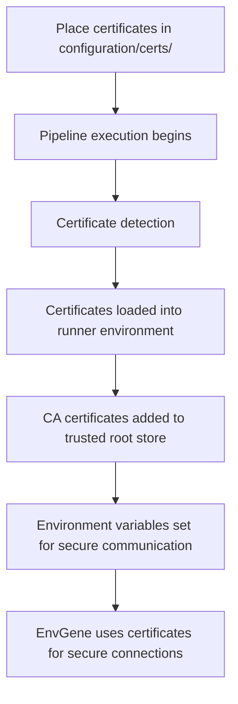
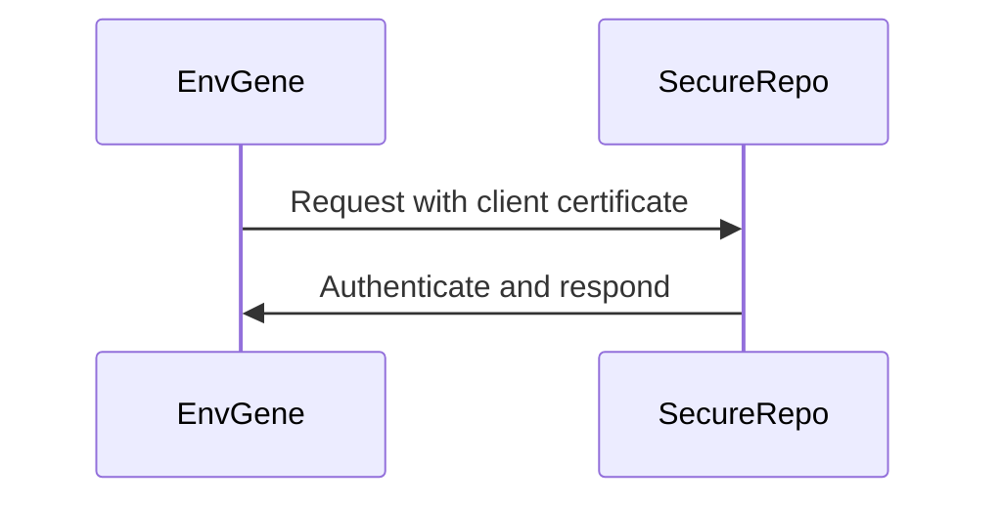

# System Certificate Configuration

- [System Certificate Configuration](#system-certificate-configuration)
  - [Problem Statement](#problem-statement)
  - [Approach](#approach)
    - [Certificate Management Process](#certificate-management-process)
    - [Supported Certificate Types](#supported-certificate-types)
    - [Certificate Chain Ordering](#certificate-chain-ordering)
    - [How to Obtain Required Certificates](#how-to-obtain-required-certificates)
      - [Using OpenSSL to Retrieve Server Certificates](#using-openssl-to-retrieve-server-certificates)
      - [Extracting Individual Certificates from Chain](#extracting-individual-certificates-from-chain)
      - [Using Browser to Export Certificates](#using-browser-to-export-certificates)
      - [Verifying Certificate Chains](#verifying-certificate-chains)
  - [Usage Examples](#usage-examples)
    - [Secure Artifact Repositories](#secure-artifact-repositories)
    - [Internal Services with Self-Signed Certificates](#internal-services-with-self-signed-certificates)
  - [Technical Implementation](#technical-implementation)
  - [Troubleshooting](#troubleshooting)
    - [Common Issues](#common-issues)
    - [Debugging Tips](#debugging-tips)

## Problem Statement

When deploying environments in enterprise settings, teams face several certificate-related challenges:

1. Secure Communication Barriers:
   1. Internal services use self-signed certificates not trusted by default
   2. Artifact repositories require client certificate authentication

2. Manual Certificate Management:
   1. Manually installing certificates on build agents is error-prone
   2. Certificate updates require manual intervention
   3. Different environments may require different certificates

Goals:

1. Provide a consistent way to manage certificates across all environments
2. Automate certificate installation during pipeline execution
3. Support various certificate types and authentication methods
4. Eliminate manual certificate management on build agents

## Approach

EnvGene provides a built-in mechanism for managing system certificates through a dedicated directory in the environment instance repository. Certificates placed in this directory are automatically loaded and configured during pipeline execution.

### Certificate Management Process

The system certificate configuration feature in EnvGene automatically handles certificates placed in the `configuration/certs/` directory of your environment instance repository. During pipeline execution:

1. EnvGene checks for certificate files in the `configuration/certs/` directory
2. Detected certificates are loaded into the runner environment
3. CA certificates are added to the system's trusted root certificate store
4. Environment variables are set to ensure tools and libraries use the certificates
5. EnvGene uses these certificates for secure communication with external systems



To use this feature:

1. Create a `certs` directory within the `configuration` folder of your environment instance repository:

   ```text
   /configuration
   /certs
      your-ca-cert.pem
      your-client-cert.p12
   ```

2. Place your certificate files in this directory
3. Commit and push these changes to your repository
4. When the pipeline runs, these certificates will be automatically loaded and used

### Supported Certificate Types

The system supports various certificate types:

- **CA Certificates** (`.crt`, `.pem`): Root or intermediate certificates used to validate server certificates
- **Client Certificates** (`.p12`, `.pfx`): Used for client authentication when connecting to external systems

While the system will load all certificates in the directory, following these naming conventions can help with organization:

- `ca-*.pem` or `ca-*.crt` for CA certificates
- `client-*.p12` or `client-*.pfx` for client certificates

### Certificate Chain Ordering

When dealing with certificate chains that include multiple levels (root CA, intermediate CAs, and end-entity certificates), proper ordering is crucial for certificate validation. All certificates in the chain should be combined into a single `.crt` or `.pem` file in the correct order.

**Required Order:**

1. Root CA certificate (first)
2. Intermediate CA certificates (in hierarchical order)
3. End-entity certificate (last, if applicable)

**Example Certificate Chain File (`ca-chain.pem`):**

```text
-----BEGIN CERTIFICATE-----
[Root CA Certificate - First]
MIIDXTCCAkWgAwIBAgIJAKoK/OvvXMdTMA0GCSqGSIb3DQEBCwUAMEUxCzAJBgNV
BAYTAkFVMRMwEQYDVQQIDApTb21lLVN0YXRlMSEwHwYDVQQKDBhJbnRlcm5ldCBX
...
-----END CERTIFICATE-----
-----BEGIN CERTIFICATE-----
[Intermediate CA Certificate - Second]
MIIDXTCCAkWgAwIBAgIJAKoK/OvvXMdTMA0GCSqGSIb3DQEBCwUAMEUxCzAJBgNV
BAYTAkFVMRMwEQYDVQQIDApTb21lLVN0YXRlMSEwHwYDVQQKDBhJbnRlcm5ldCBX
...
-----END CERTIFICATE-----
-----BEGIN CERTIFICATE-----
[End-Entity Certificate - Last (if needed)]
MIIDXTCCAkWgAwIBAgIJAKoK/OvvXMdTMA0GCSqGSIb3DQEBCwUAMEUxCzAJBgNV
BAYTAkFVMRMwEQYDVQQIDApTb21lLVN0YXRlMSEwHwYDVQQKDBhJbnRlcm5ldCBX
...
-----END CERTIFICATE-----
```

**Important Notes:**

- Each certificate must be in PEM format with proper `-----BEGIN CERTIFICATE-----` and `-----END CERTIFICATE-----` boundaries
- No empty lines should exist between certificates
- The order is critical for proper certificate validation
- If you have multiple certificate chains, create separate files for each chain

**Example Directory Structure with Certificate Chains:**

```text
/configuration
  /certs
    ca-chain-internal.pem       # Complete chain for internal services
    ca-chain-external.pem       # Complete chain for external services
    client-artifactory.p12      # Client certificate for Artifactory
```

### How to Obtain Required Certificates

Before configuring certificate chains, you need to identify and obtain the required certificates from your target services. Here are common methods to retrieve certificates:

#### Using OpenSSL to Retrieve Server Certificates

**For HTTPS services:**

```bash
# Get the complete certificate chain from a server
openssl s_client -connect your-site.com:443 -showcerts

# Save the certificate chain to a file
openssl s_client -connect your-site.com:443 -showcerts < /dev/null 2>/dev/null | openssl x509 -outform PEM > server-cert.pem

# Get certificate chain with SNI (Server Name Indication) support
openssl s_client -connect your-site.com:443 -servername your-site.com -showcerts
```

**For non-HTTPS services (custom ports):**

```bash
# For services running on custom ports
openssl s_client -connect internal-service.company.com:8443 -showcerts

# For services with custom protocols
openssl s_client -connect ldap-server.company.com:636 -showcerts
```

#### Extracting Individual Certificates from Chain

When you run `openssl s_client -showcerts`, you'll see output like:

```text
-----BEGIN CERTIFICATE-----
[Certificate 1 - Usually the server certificate]
-----END CERTIFICATE-----
-----BEGIN CERTIFICATE-----
[Certificate 2 - Intermediate CA]
-----END CERTIFICATE-----
-----BEGIN CERTIFICATE-----
[Certificate 3 - Root CA]
-----END CERTIFICATE-----
```

**To create a proper certificate chain file:**

1. Copy certificates in reverse order (Root CA first, then intermediates, then server cert if needed)
2. Save them to a single `.pem` file with proper ordering

#### Using Browser to Export Certificates

**Alternative method for web services:**

1. Open the site in your browser
2. Click on the lock icon in the address bar
3. View certificate details
4. Export the certificate chain
5. Convert to PEM format if needed

#### Verifying Certificate Chains

**Before using certificates, verify they form a valid chain:**

```bash
# Verify certificate chain
openssl verify -CAfile ca-chain.pem target-cert.pem

# Check certificate details
openssl x509 -in certificate.pem -text -noout

# Test certificate chain against a server
openssl s_client -connect hostname:port -CAfile ca-chain.pem -verify_return_error
```

## Usage Examples

### Secure Artifact Repositories

**Scenario**: EnvGene needs to connect to secure artifact repositories that require certificate-based authentication.

**Implementation**:

1. Obtain the client certificate for the artifact repository
2. Place the files in the `configuration/certs/` directory:

   ```text
   /configuration
   /certs
      ca.pem          # CA certificate
      client-artifactory.p12    # Client certificate for Artifactory
   ```

3. The certificate will be automatically used for authentication during pipeline execution



### Internal Services with Self-Signed Certificates

**Scenario**: EnvGene needs to communicate with internal services that use self-signed certificates.

**Implementation**:

1. Obtain the self-signed certificate used by the internal service
2. Place the certificate in the `configuration/certs/` directory:

   ```text
   /configuration
   /certs
      ca-internal-service.pem  # Self-signed certificate
   ```

3. The certificate will be automatically added to the trusted root store during pipeline execution

## Technical Implementation

Under the hood, EnvGene uses a certificate handling script that:

1. Detects the operating system of the runner
2. Copies certificates to the appropriate system location based on the OS:
   - Debian/Ubuntu: `/usr/local/share/ca-certificates/`
   - CentOS/Red Hat: `/etc/pki/ca-trust/source/anchors/`
   - Alpine: appends to `/etc/ssl/certs/ca-certificates.crt`
3. Updates the CA trust store using the appropriate command for the OS:
   - Debian/Ubuntu: `update-ca-certificates --fresh`
   - CentOS/Red Hat: `update-ca-trust`
4. Sets environment variables like `REQUESTS_CA_BUNDLE` for Python-based tools

## Troubleshooting

### Common Issues

1. **Certificate not recognized**:
   - Ensure the certificate is in the correct format
   - Check that the certificate is placed in the correct directory

2. **Connection failures**:
   - Verify that the certificate is not expired
   - Ensure the certificate is trusted by the target system

3. **Pipeline failures**:
   - Check pipeline logs for certificate loading errors
   - Verify that the certificate files have the correct permissions

### Debugging Tips

To debug certificate issues:

1. Check the pipeline logs for certificate loading messages
2. Verify that environment variables like `REQUESTS_CA_BUNDLE` are set correctly
3. Use tools like `openssl` to validate certificate chains
