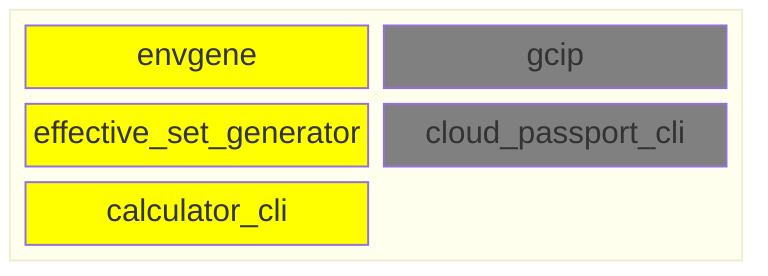

# SBOM

- [SBOM](#sbom)
  - [Problem Statement](#problem-statement)
  - [Proposed Approach](#proposed-approach)
    - [Requirements](#requirements)
    - [SBOM types](#sbom-types)
      - [Solution SBOM](#solution-sbom)
      - [Application SBOM](#application-sbom)
      - [Environment Template SBOM](#environment-template-sbom)
  - [Use Cases](#use-cases)
  - [Affection map](#affection-map)
  - [Links](#links)

## Problem Statement

The lack of a standard data exchange format between the CLI and the Effective Set Generator complicates integration.

## Proposed Approach

It is proposed to use CycloneDX SBOM as the unified data exchange format between the Calculator CLI and the Effective Set Generator. It is proposed to implement an architecture where the Calculator CLI calculates the Effective Set solely based on local parameter structures, eliminating direct dependency on external sources.

It is also proposed to use CycloneDX SBOM as a carrier of information about the location of artifacts included in the solution.

It is assumed that the CycloneDX SBOM is generated by some unspecified external system or prepared manually.

### Requirements

1. The Calculator CLI must support loading and parsing SBOM files, extracting parameters for calculating the Effective Set
2. Envgene must support loading and parsing SBOM files, extracting parameters for downloading environment template artifact
3. SBOMs can be stored in a remote repository
4. The SBOM must be valid and comply with the following JSON schemas:
   1. [Solution SBOM](/schemas/solution.sbom.schema.json)
   2. [Application SBOM](/schemas/application.sbom.schema.json)
   3. [Environment Template SBOM](/schemas/env-template.sbom.schema.json)

### SBOM types

#### Solution SBOM

A JSON file compliant with the CycloneDX specification, describing the following aspects of a solution:

1. The composition of the solution's applications
2. For each application:
   1. ```deployPostfix``` - The namespace name template where the application should be deployed.
   2. Coordinates of the application SBOM.
3. Environment Instance location

[Example](/examples/solution.sbom.json)

#### Application SBOM

A JSON file compliant with the CycloneDX specification, describing the following aspects of an application:

1. The composition of the application's microservices
2. Coordinates of the microservice's artifacts such as docker image
3. Application's components attributes

[Example](/examples/application.sbom.json)

#### Environment Template SBOM

A JSON file compliant with the CycloneDX specification, describing the following aspects of an environment template:

1. Coordinates of the environment template artifact

[Example](/examples/application.sbom.json)

## Use Cases

1. TBD

## Affection map



## Links

[Purl specification](https://github.com/package-url/purl-spec)
[CycloneDX specification](https://cyclonedx.org/docs/1.6/json/)
