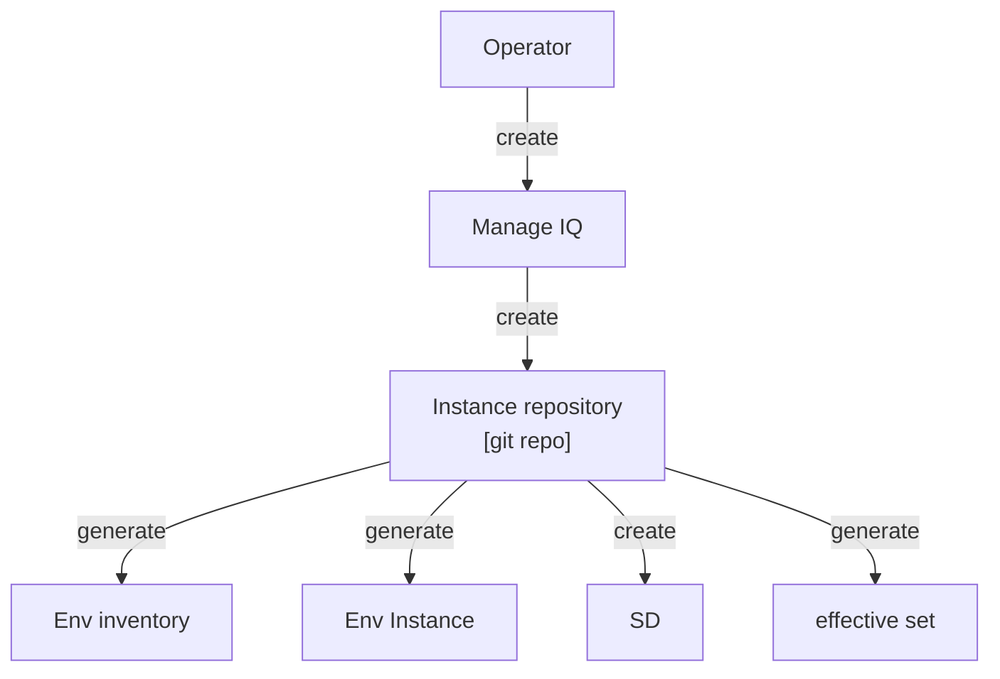

# EnvGene External Interface Documentation

## Table of Contents
- [Problem Statements](#problem-statements)
- [Goals](#goals)
- [Requirements](#requirements)
- [Limitations](#limitations)
- [Use Cases](#use-cases)
- [Open Questions](#open-questions)
- [Proposed Approach](#proposed-approach)
- [Detailed Requirements](#detailed-requirements)
- [Instance Repository Pipeline Parameters](#instance-repository-pipeline-parameters)
- [ENV_SPECIFIC_PARAMS](#env_specific_params)
- [SD Processing](#sd-processing)
- [Effective Set Calculation](#effective-set-calculation)
- [Env Inventory Examples](#env-inventory-examples)

## Problem Statements

When using EnvGene with UPP (Unified Platform Pipeline) and ManageIQ (UI for UPP), PaaS engineers only need to use the ManageIQ interface. They don't have to deal with EnvGene directly. This means they don't manually create Environment Inventories.

However, EnvGene currently can't automatically create these inventories for other systems.

## Goals

Create a new interface in EnvGene that enables external systems to create Env Inventory without direct user interaction with EnvGene repositories.

## Requirements

- No dependency on deployer CMDB
- EnvGene must store SD (out of scope for this article, will be described in [SD Processing](#sd-processing))
- It should be possible to find out which app:ver each individual SD was received from and is located in the EnvGene repo (for example, EnvGene adds this information in userdata)
- EnvGene must calculate effective set (out of scope for this article, will be described in [Effective Set Calculation](#effective-set-calculation))
- Effective set may not contain cluster token
- Env Template delivered to a customer must not contain any parameters of another customer (Out of scope for this article, will be described in future documentation)

## Limitations

**Tenant template must be developed in such a way that:**
- Tenant name not parameterized, i.e. the value is set in the template
- Tenant owner not parameterized, i.e. the value is set in the template

**Cloud template must be developed in such a way that:**
- inventory.clusterUrl parameter is sufficient to render Cloud
- defaultCredentialsId: ""

Additional limitations:
- UPP doesn't store SD state - EnvGene is a master storage for SD
- Integration with cloud-deployer is used for Artifact Definition (for SD artifact) discovery
- There will be no ManageIQ in on-site environments
- In on-site environments, EnvGene inventory is created directly in the EnvGene repository (as a file)
- Deletion of environments in EnvGene is done by deleting files in the EnvGene repository, not by running the EnvGene pipeline

## Use Cases

- I as UPP operator want to trigger EnvGene to generate deployment parameters without pre-created Env Inventory
- I as UPP operator want to trigger EnvGene to set env-specific parameters for a particular Environment
- I as UPP operator want to trigger EnvGene to update SD

## Open Questions

- Where in Instance repository should the SD be folded?
  - `/environments/<cloud-name>/<env-name>/Inventory/SD.yml`
- How to transmit:
  - Per namespace/cloud env-specific parameters
    - envSpecificParamsets in [ENV_SPECIFIC_PARAMS](#env_specific_params)
  - Additional parameters for template rendering
    - additionalTemplateVariables in [ENV_SPECIFIC_PARAMS](#env_specific_params)
  - Cluster URL
    - clusterParams.clusterEndpoint in [ENV_SPECIFIC_PARAMS](#env_specific_params)
  - Cluster token
    - clusterParams.clusterToken in [ENV_SPECIFIC_PARAMS](#env_specific_params)
- Do we introduce envSpecificParameters?
  - Yes
- Do we allow UPP to commit to the instance repository to modify SD?
  - No
- Can we eliminate from the template:
  - tenant
    - Not currently. 
  - cloud parameters except *Parameters and *ParameterSets
    - Yes
- How to manage value-sensitive parameters?
  - By creating credential files and associating them with the environment using sharedMasterCredentialFiles

## Proposed Approach



## Detailed Requirements

| ID | Requirement | Description |
|----|-------------|-------------|
| REQ-1 | inventory.deployer is optional attribute of Env Inventory | In ARGO case there is no NC deployer/CMDB |
| REQ-2 | inventory.cloudPassport is optional attribute of Env Inventory | If the parameter is not set CP is not used for Cloud generation |
| REQ-3 | Paramsets created with ENV_SPECIFIC_PARAMS must be used in instance generation | |
| REQ-4 | Paramsets created using ENV_SPECIFIC_PARAMS must be validated before creation | |

## Instance Repository Pipeline Parameters

| Parameter | Description | Type | Example | Required |
|-----------|-------------|------|---------|----------|
| ENV_NAMES | Environment or Environments for which processing will be launched. In `<cloud-name>/<env-name>` notation | string | ocp-01/platform | y |
| ENV_BUILDER | Feature flag. If "true", Env Instance generation will be launched | string | "true" always | y |
| GET_PASSPORT | Feature flag. If "true", Cloud Passport discovery will be launched | string | "false" always | y |
| CMDB_IMPORT | Feature flag. If "true", Env Instance import into CMDB will be launched | string | "false" always | y |
| DEPLOYMENT_TICKET_ID | Used as commit message prefix for commit into Instance repository | string | "ITDPL-12345" | n |
| SD_SOURCE_TYPE | See details in [SD processing](#sd-processing) | string | "artifact" OR "json" | n |
| SD_DATA | See details in [SD processing](#sd-processing) | json in string | | n |
| ENV_INVENTORY_INIT | If "true", the new Env Inventory will be generated in the path `/environments/<ENV_NAME>/Inventory/env_definition.yml`. If "false" can be updated only | string | "true" OR "false" | n |
| ENV_TEMPLATE_VERSION | System override envTemplate.templateArtifact.artifact.version OR envTemplate.artifact at `/environments/<ENV_NAME>/Inventory/env_definition.yml` | string | sd.env_deployment-configuration_env-platform-templates:master-20240626.130535-141 | n |
| ENV_TEMPLATE_NAME | System override envTemplate.name at `/environments/<ENV_NAME>/Inventory/env_definition.yml` | string | platform_template | n |
| ENV_SPECIFIC_PARAMS | If specified, Env Inventory is updated. See details in [ENV_SPECIFIC_PARAMS](#env_specific_params) | json in string | See [example below](#env_specific_params) | n |
| GENERATE_EFFECTIVE_SET | See details in [Effective set calculation](#effective-set-calculation) | string | "true" OR "false" | n |

## ENV_SPECIFIC_PARAMS

```json
{
    "clusterParams": {
        "clusterEndpoint": "<value>",
        "clusterToken": "<value>"
    },
    "additionalTemplateVariables": {
        "<key>": "<value>"
    },
    "cloudName": "<value>",
    "tenantName": "<value>",
    "deployer": "<value>",
    "envSpecificParamsets": {
        "<ns-template-name>": [
            "paramsetA"
        ],
        "cloud": [
            "paramsetB"
        ]
    },
    "paramsets": {
        "paramsetA": {
            "version": "<paramset-version>",
            "name": "<paramset-name>",
            "parameters": {
                "<key>": "<value>"
            },
            "applications": [
                {
                    "appName": "<app-name>",
                    "parameters": {
                        "<key>": "<value>"
                    }
                }
            ]
        },
        "paramsetB": {
            "version": "<paramset-version>",
            "name": "<paramset-name>",
            "parameters": {
                "<key>": "<value>"
            },
            "applications": []
        }
    },
    "credentials": {
        "credX": {
            "type": "<credential-type>",
            "data": {
                "username": "<value>",
                "password": "<value>"
            }
        },
        "credY": {
            "type": "<credential-type>",
            "data": {
                "secret": "<value>"
            }
        }
    }
}
```

### ENV_SPECIFIC_PARAMS Details

| Field | Description | Type | Example | Required |
|-------|-------------|------|---------|----------|
| clusterParams | Cluster connection parameters | map | | y |
| clusterParams.clusterEndpoint | System override inventory.clusterUrl at `/environments/<ENV_NAME>/Inventory/env_definition.yml` | string | "https://api.ocp-01.cluster.example.com:6443" | y |
| clusterParams.clusterToken | System add Credential at `/environments/<ENV_NAME>/Credentials/credentials.yml`. If Credential already exists, the value is not overridden | string | | n |
| additionalTemplateVariables | System merges the value into envTemplate.additionalTemplateVariables | map | `{"keyA": "valueA", "keyB": "valueB"}` | n |
| cloudName | System override inventory.cloudName | string | "cloud01" | n |
| tenantName | System override inventory.tenantName | string | "customer1" | n |
| deployer | System override inventory.deployer | string | "deployer1" | n |
| envSpecificParamsets | System merges the value into envTemplate.envSpecificParamsets | map | See example | n |
| paramsets | System creates Parameter Set object for each first level key in the path environments/<ENV_NAME>/Inventory/parameters/KEY-NAME.yml | map | See [examples below](#env-inventory-with-env-specific-parameters) | n |
| credentials | System creates Credential object for each first level key. All credentials types supported in EnvGene must be supported | map | See [credentials example](#env-inventory-with-env-specific-parameters) | n |

## SD Processing

*Note: This section is out of scope for this article and will be described in detail separately. This is a placeholder for reference.*

The SD (Service Definition) processing will define:
- How SD is stored in the EnvGene repository
- The format and structure of SD data
- How to track which app:ver each SD was received from

## Effective Set Calculation

*Note: This section is out of scope for this article and will be described in detail separately. This is a placeholder for reference.*

The Effective Set Calculation will define:
- How EnvGene calculates the effective set of parameters
- Security considerations (e.g., cluster token must not be included)
- Integration with deployment processes

## Env Inventory Examples

### Minimal Env Inventory

```yaml
# /environments/<cloud-name>/<env-name>/Inventory/env_definition.yml
inventory:
    environmentName: <env-name>
    clusterUrl: <cloud> # for example "https://api.cluster-01.openshift.example.com:6443"
envTemplate:
    name: <env-template-name>
    artifact: <app:ver>
```

### Env Inventory with env-specific parameters

```yaml
# /environments/<cloud-name>/<env-name>/Inventory/env_definition.yml
inventory:
    environmentName: <env-name>
    clusterUrl: <cloud> # for example "https://api.etbss-vmw-01.openshift.sdntest.netcracker.com:6443"
envTemplate:
    # additional variables that will be available
    # during template processing
    additionalTemplateVariables:
        <key>: <value>
    # environment specific parameters that will be set
    # to deployParameters of cloud or namespace objects
    # during template processing
    envSpecificParamsets:
        cloud: [ "paramsetA" ]
        <ns-template-name>: [ "paramsetB" ]
    sharedMasterCredentialFiles: [ "inventory_generation_creds" ]
    name: <env-template-name>
    artifact: <app:ver>
```

```yaml
# /environments/<cloud-name>/<env-name>/Credentials/credentials.yml
cloud-admin-token:
    type: "secret"
    data:
        secret: <cloud-token> # in clear text
```

```yaml
# environments/<cloud-name>/<env-name>/Inventory/parameters/paramsetA.yml
paramsetA:
    version: <paramset-ver>
    name: <paramset-name>
    parameters:
        <key>: <value>
    applications:
        - appName: <app-name>
          parameters:
              <key>: <value>
```

```yaml
# environments/<cloud-name>/<env-name>/Inventory/parameters/paramsetB.yml
paramsetB:
    version: <paramset-ver>
    name: <paramset-name>
    parameters:
        <key>: <value>
    applications: []
```

```yaml
# environments/<cloud-name>/<env-name>/Inventory/credentials/inventory_generation_creds.yml
credX:
    type: <credential-type>
    data:
        username: <value>
        password: <value>
credY:
    type: <credential-type>
    data:
        secret: <value>
```